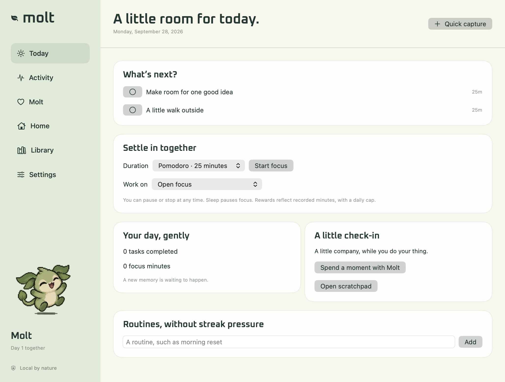

# Molt

A little life, alongside yours. A native macOS pixel-art companion with a personality, a home, meaningful play, and room for your day.



## Run

Requires macOS 13+ and Swift 5.9+. No runtime packages, account, or internet connection are required.

```sh
swift run Molt
```

For the full desktop experience, including macOS notifications and launch at login, use the packaged app:

```sh
DEVELOPER_DIR=/Applications/Xcode.app/Contents/Developer ./scripts/package.sh 0.2.0
open dist/Molt.app
```

The package script creates a universal Apple Silicon / Intel app and DMG. Set `MOLT_UNIVERSAL=0` to build for the host architecture only. Full Xcode is required for universal builds and XCTest. If Command Line Tools is selected, prefix test commands with `DEVELOPER_DIR=/Applications/Xcode.app/Contents/Developer`.

## Meet your companion

Name and personalize a fin-eared pixel creature. Choose palettes, markings, body proportions and earned accessories. Save outfits, decorate a tiny home, teach eight tricks, send Molt on fictional explorations, and grow into different forms. Care and interests shape evolution; unlocked skills and keepsakes never disappear through neglect. Vacation mode pauses care and excludes paused time from evolution age.

Molt has a transparent floating window, menu bar controls, and a native dashboard:

- **Today:** three chosen priorities, upcoming reminders/calendar events, focus, daily review and gentle routines.
- **Activity:** honest system-health readings and optional app-time estimates.
- **Molt:** needs, cooldowns, training, discovery book, three games and a bounded memory journal.
- **Home:** decoration, wardrobe, portraits, a pixel drawing canvas and visual melody score.
- **Library:** tasks, checklists, projects, recurrence, notes, pinned notes, saved links, search and reminders.
- **Settings:** profile, sleep/quiet hours, reduced motion, desktop behavior, permissions, exports and creator tools.

The pet can be dragged, hidden, made click-through, restored from the menu bar, or allowed to wander within a small area. Utility tools are independent of pet needs and cooldowns. The menu bar’s quick capture supports task/note/reminder entry and explicit commands. Command-Shift-K opens it while Molt is active.

## Cooldowns that survive a restart

| Activity | Cooldown |
| --- | --- |
| Full meal | 30 minutes, also limited by satiety |
| Snack / toy play | 10 minutes |
| Rewarded reassurance | 15 seconds |
| Groom / story | 10 minutes |
| Water | 5 minutes |
| Trick lesson | 20 minutes, shared across tricks |
| Rewarded game | 15 minutes per game |
| Exploration | 2 hours after return |
| Creative activity | 30 minutes |
| Practice games, rest, tools | No cooldown |

Cooldown groups prevent renamed actions from bypassing limits. A daily 60-XP soft cap and diminishing repeated care rewards encourage variety. Active activities cannot overlap. Rewards and completions are saved together, and focus reward delivery is idempotent across the pet/utility stores. Rest restores energy through elapsed time, not repeated clicks. Basic nourishment recovery remains available below 25 even during cooldowns.

## Games

**Memory Meadow**, **Molt Fetch**, and **Rhythm Steps** are playable with keyboard controls, no audio and no precision timer. Gentle difficulty earns the same rewards. Practice has no progression rewards. Rounds persist, pause when the window loses focus, and can be resumed or ended explicitly.

## Privacy and data

Core Molt makes no network calls. System readings stay in memory. App tracking, notifications, and calendar access have separate controls; tracking starts off. Calendar integration reads only selected calendars and never edits events. No keystrokes, clipboard, window titles, screenshots, browser history, audio, or document contents are collected.

App-time records are estimates. Known sleep/session gaps are excluded, but idle time and private browsing cannot be reliably inferred. Exclude a browser’s bundle ID if you do not want it tracked. Exclusions apply before recording; raw intervals expire after seven days. Forgetting activity history does not delete your pet or organization tools.

Data lives in `~/Library/Application Support/Molt/`:

| File | Purpose |
| --- | --- |
| `pet-state.json` | Versioned pet snapshot, embedded species, cooldowns, progress and recent memories |
| `pet-state.backup.json` | Previous decodable snapshot |
| `pet-state.before-v2.json` | Original pre-migration save, preserved once |
| `organization.sqlite` | Transactional tasks, notes, reminders, routines, focus and optional app intervals |
| `Definitions/` | Imported species definitions |
| `Assets/<pet-id>/` | Imported local sprite atlases |
| `archive-*.json` | Pets archived before a switch or import |

Pet export/import is separate from organization export, outfits, species, portraits and journal export. A portable pet archive includes its species and custom atlas, with no organization or app-tracking data. Back up the entire data directory while Molt is closed for a complete backup, including SQLite sidecar files if present. Failed loads preserve originals and offer the data folder for recovery; the Settings panel can restore the previous pet save.

## Make your own species

Import a JSON file or a directory containing `definition.json` and an optional 4-by-4 PNG atlas. Packs are data only, with version/reference/cycle/path/size checks. Import previews metadata and archives the current pet before starting a new one. A form plus JSON editor validates a sandbox simulation without changing the active pet.

Three bundled examples have distinct mechanics: classic **Molt**, slower-growing **Fern**, and focus-themed **Orbit**. See [definition authoring](docs/definitions.md).

## Development and releases

```sh
swift test
python3 scripts/check-copy.py
swift build -c release
./scripts/package.sh 0.2.0
```

Tests cover migration, offline decay, DST, vacation, clock rollback, cooldown groups, duplicate/early completion, reward caps, all games, SQLite round trips, unsafe packs and tracking exclusions. The eight-hour test simulates ticks; it is not a real-time performance certification. See [architecture](docs/architecture.md), [verification](docs/verification.md), and [contributing](CONTRIBUTING.md).

Push a `v*` tag to build and publish a DMG through GitHub Actions. Bundles receive a local ad-hoc signature for Apple Silicon execution. Releases have no Developer ID signature or notarization yet. macOS may require Open Anyway approval in Privacy & Security. There is no automatic updater.

AI dialogue, rich browser/document integrations, sync, social features and an online marketplace remain outside this offline release, as specified by the roadmap. Cosmetic expansion and extended hardware/accessibility qualification are tracked in [release scope](docs/release-scope.md).
