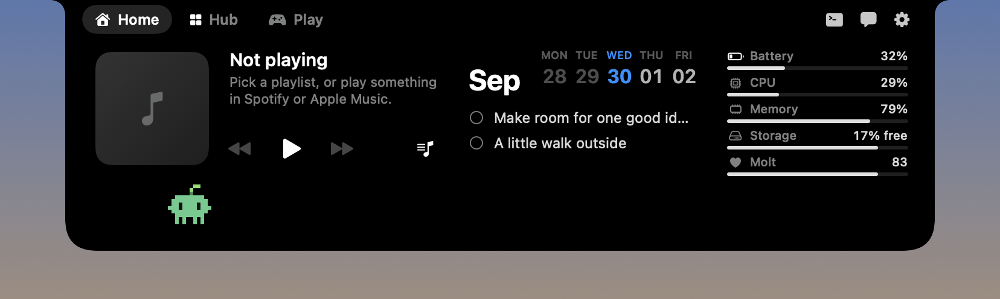
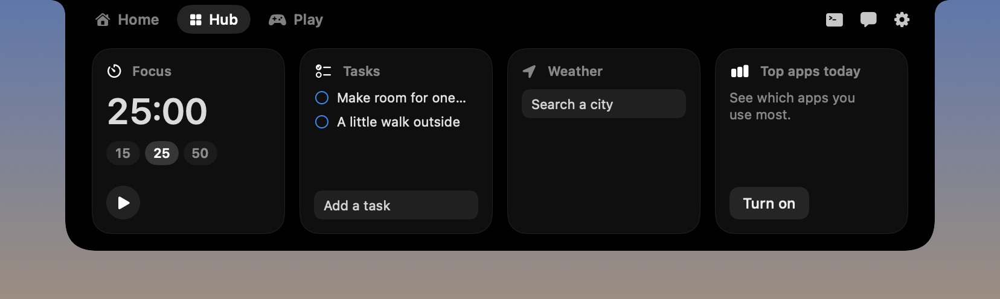
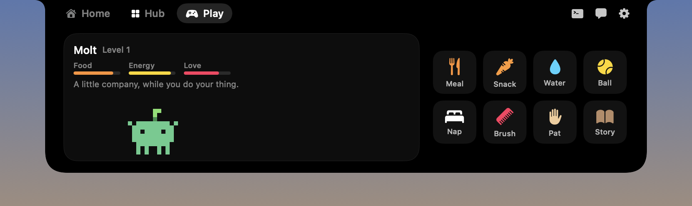

# Molt

A little companion that lives in your MacBook's notch.

Molt is a native macOS notch app. Hover over the notch and it opens into a black panel that looks like part of the hardware: your music, your week, your Mac's health, and Molt, a small pixel creature that runs around when you look after it.



## Open the notch

Hover over the notch, or press **Command-Shift-Enter**. Move the pointer away, press the shortcut again, or press Escape to close it. Hover-to-open can be turned off in Settings.

Every page is the same size. Home, Hub and Play sit left of the notch; Claude Code & Codex, Chat and Settings sit to its right as icons.

## Pages

- **Home:** now playing, a five-day calendar strip with today's events or tasks, and Mac health (battery, CPU, memory, storage, and Molt's care level). Molt scurries along the bottom, or sleeps.
- **Hub:** four tiles. Focus timer, today's tasks, weather for your city, and your three most-used apps today with their icons.
- **Play:** a tamagotchi. Drag a meal, snack, water, ball, nap, brush, pat or story onto Molt, or click it. Each has a short cooldown. The more you care for Molt, the livelier it gets and the more it runs around on Home.
- **Claude Code & Codex:** your conversations from both tools, newest first, with today's and this week's token usage. Pick one to read it. Molt can keep a private copy of every chat so they survive the tools' own cleanup.
- **Chat:** talk to Molt through Ollama on this Mac.
- **Settings:** Molt's name and color, accent color, hover, display, launch at login, and every connection.





## Music

Home follows whichever of Spotify or Apple Music is playing, with artwork, a draggable progress bar and playback controls. While music plays and Molt is closed, the artwork and a level meter sit on either side of the notch.

Click the artwork or the playlist button to browse your playlists as a row of covers. Clicking one plays it in the background; Molt starts the music app hidden, so you never have to switch to it.

- **Apple Music:** choose **Connect Apple Music**. Molt reads the playlists in your library on this Mac. macOS asks once to let Molt control Music.
- **Spotify:** Spotify only lets registered apps sign in, so there's a one-time setup. Create a free app at [developer.spotify.com/dashboard](https://developer.spotify.com/dashboard), add `http://127.0.0.1:43821/callback` as its redirect URI, paste its Client ID into Molt, and choose **Connect**. You sign in on Spotify's own page; Molt stores the sign-in in your keychain. With Spotify connected, Home also shows and controls what's playing on your phone or another device (remote control needs Spotify Premium).

## Local helper

Chat uses Ollama on this Mac and has no cloud fallback. Attach a text file with the paperclip.

## Run and package

Requires macOS 13+, Swift 5.9+, and full Xcode for universal builds and XCTest.

```sh
swift run Molt
DEVELOPER_DIR=/Applications/Xcode.app/Contents/Developer swift test --scratch-path .build-xcode
DEVELOPER_DIR=/Applications/Xcode.app/Contents/Developer ./scripts/package.sh 0.7.0
open dist/Molt.app
```

The package script produces `dist/Molt-0.7.0.dmg` and an ad-hoc signed universal app. Ad-hoc signing is not Apple notarization. Set `MOLT_UNIVERSAL=0` for a host-only development build.

## Privacy and permissions

- Calendar, app usage, Mac health, and Claude Code & Codex reading are each off until you turn them on.
- Claude Code and Codex chats are read from `~/.claude/projects` and `~/.codex/sessions`. Copies are kept in `~/Library/Application Support/Molt/Sessions`. Nothing is uploaded.
- App usage is estimated from the frontmost app while Molt runs. It is not Apple's Screen Time.
- Spotify tokens are kept in the macOS keychain. Spotify artwork is loaded from Spotify's image servers.
- Weather sends only your city search and chosen coordinates to [Open-Meteo](https://open-meteo.com/) (CC BY 4.0).
- No screen capture, clipboard collection or keystroke recording.

## Development references

- [Architecture](docs/architecture.md)
- [Companion definitions](docs/definitions.md)
- [Release scope](docs/release-scope.md)
- [0.7.0 release notes](docs/releases/0.7.0.md)
