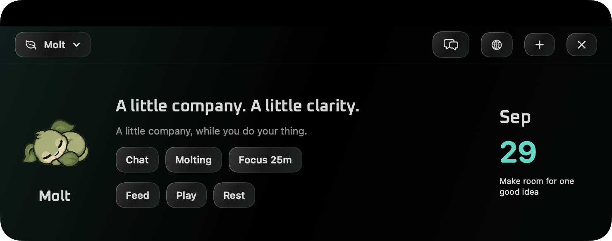
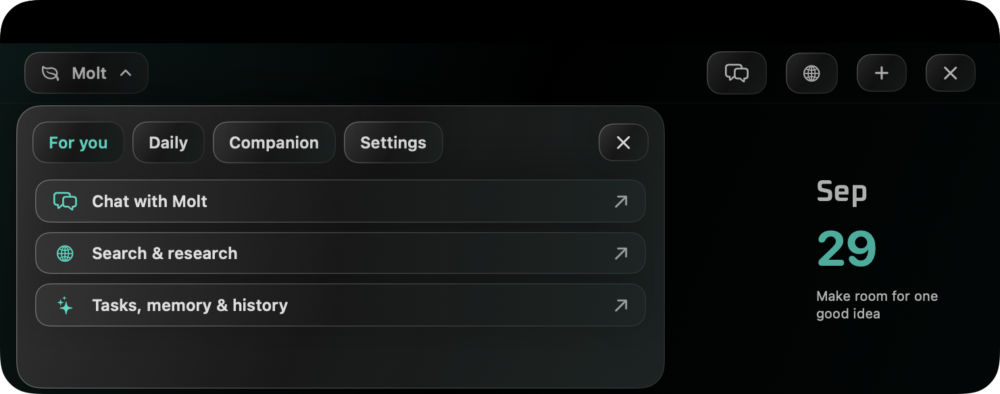

# Molt 0.4.2

**Released:** September 29, 2026  
**Focus:** Glass interface, animated controls, and handcrafted notch navigation.

Molt 0.4.2 refreshes the notch interface with layered glass surfaces, responsive buttons, and a custom navigation panel. It builds on the personal chat, research, task planning, approved memory, and action history introduced in earlier versions.

## New glass interface

- Frosted glass styling for shared cards and notch controls.
- Subtle accent lighting across the panel background.
- Fine highlight borders and gradients that give controls depth.
- Refined rounded buttons with consistent spacing and typography.
- Dark and light appearances, plus a system appearance option.
- The black connection to the physical Mac notch remains intact.

## Animated controls and text

- Buttons highlight on hover and compress slightly when pressed.
- Hover and press feedback uses short, smooth transitions.
- Page content, including its text, fades and slides into place when navigating.
- Companion message changes crossfade.
- The navigation chevron rotates as the panel opens and closes.
- The custom navigation panel fades and moves into place.
- Category changes animate within the navigation panel.

Motion responds to interaction rather than adding continuous background shimmer. The existing notch expansion and retraction remain available through the global shortcut.

## Handcrafted navigation

The top-left navigation control now opens a custom panel inside Molt instead of a native macOS dropdown menu. It includes category buttons, icon rows, selection indicators, and glass styling.

### For you

Frequently used features appear first:

- **Chat with Molt:** personal local chat and explicit screen help.
- **Search & research:** Molting web search and source comparison.
- **Tasks, memory & history:** agent planning, approved memories, and action review.

### Daily

- Quick controls
- Today & focus
- Tasks & notes
- Quick capture
- Projects & tools

### Companion

- Care & training
- Play together
- Home & wardrobe
- Computer health

### Settings

- Preferences
- Local AI setup
- Custom Dark, Light, and System appearance buttons
- Mint, Blue, Violet, Amber, and Rose accent controls
- Automatic, active-display, and individual-display selection
- Shortcut registration status

Longer category content scrolls within the panel. While navigation is open, the underlying page is disabled and hidden from accessibility navigation.

## Controls

| Action | Control |
| --- | --- |
| Open or hide the notch panel | **Command-Shift-Enter**, while Molt is running |
| Open navigation | Click the top-left **Molt** or current-page button |
| Dismiss navigation | Click outside it, click its close button, or press **Escape** |
| Hide Molt after dismissing navigation | Press **Escape** again |
| Open common tools directly | Use the toolbar's Chat, Molting, and Quick Capture buttons |

## Accessibility

- Molt's reduced-motion preference and macOS Reduce Motion disable the new interface movement.
- macOS Reduce Transparency uses opaque surface fills.
- Buttons retain native button semantics and keyboard focus support despite their custom visual treatment.
- Navigation controls expose labels, selected states, and expanded/collapsed status.
- Disabled buttons have a distinct visual treatment.

## Documentation

- Updated the README to describe the glass interface and custom navigation.
- Added new screenshots of the notch panel and navigation.
- Documented dismissal behavior, appearance controls, and accessibility settings.
- Updated packaging references and the default package version to **0.4.2**.

## Included from previous versions

The following remain available but are **not new in 0.4.2**:

- Pixel-art companion care, games, home customization, and cooldowns.
- Local AI through Ollama or the managed local model.
- Permission-based, one-shot screen help with reviewed image or extracted-text sharing.
- Molting web search and user-directed comparison of two to five public sources.
- Task plans containing up to six independently approved task, note, or focus actions.
- Explicitly approved memory with edit, pause, and forget controls.
- Action history and undo for unchanged task and note creations.

## Installation and compatibility

Use **Molt-0.4.2.dmg** to install the packaged app. The app contains both Apple Silicon and Intel binaries.

- Core companion: macOS 13 or later.
- Managed local AI: macOS 13.3 or later, with a separate model download.
- One-shot screen capture: macOS 14 or later; screenshot attachment remains available on macOS 13.
- Image understanding requires a compatible local Ollama vision model. Extracted-text help works with a local text model.

Launch Molt before using **Command-Shift-Enter**. The shortcut opens an already-running app; it does not launch a stopped app.

## Verification and limitations

- Local test suite: **51 passed, 4 optional integration tests skipped**, with no failures.
- GitHub build and test checks passed on `main`.
- Universal release build succeeded for **arm64** and **x86_64**.
- App code-signature verification and installer checksum verification passed.
- Dark, light, and custom-navigation previews were rendered and visually inspected.

The app is ad-hoc signed. Signature verification does not establish Apple notarization. Physical-notch animation, full keyboard/VoiceOver interaction, and behavior across real display configurations were not fully verified through live UI automation in this release.

[View the successful GitHub checks](https://github.com/vkn889/Molt/actions/runs/36543449120)

## Changes included

- `e5d36ab` - Introduce animated glass controls and custom notch navigation
- `0fe0b55` - Refresh interface screenshots and document glass navigation
- `1dc9b05` - Merge glass interface and handcrafted animated navigation
